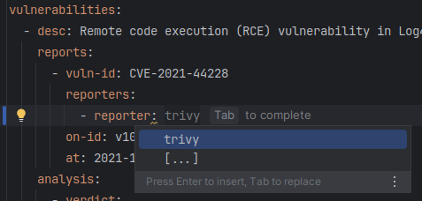
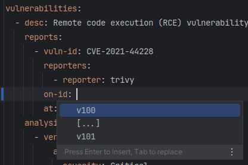

# Vulnlog Proof of Concepts

Experimental repository for testing new Vulnlog ideas, approaches, and technologies.

[](https://snapcraft.io/vl-yaml)

## Background: YAML and JSON Schema PoC

### Why This PoC Exists

The current Kotlin custom scripting DSL has limitations that need addressing:

- Flaky DSL detection in IDEs
- Missing Kotlin K2 support (
  see [State of Kotlin Scripting 2024](https://blog.jetbrains.com/kotlin/2024/11/state-of-kotlin-scripting-2024/))

### Design Goals

- Easy to learn, write, and read for software and security engineers
- Future-proof and maintainable

### What This PoC Does

Provides a YAML-based Vulnlog definition language with a simple CLI that:

- Deserializes YAML files into Java/Kotlin objects
- Prints parsed content to console

**Note:** This PoC does not validate beyond parsing or generate output files. It's designed for
experimentation with the vulnerability definition language.

## Project Structure

- **[yaml](yaml)** - JSON Schema and CLI parser ([README](yaml/README.md) includes build
  instructions and learnings)
- **[yaml-data](yaml-data)** - Example Vulnlog YAML files

## Quick Start

### Installation

Choose one of the following:

**Option 1: Download binaries**  
Get the latest release from [Releases](https://github.com/vulnlog/vulnlog-poc/releases) (Linux,
macOS, Windows with Java)

**Option 2: Ubuntu Snap**

```shell
sudo snap install vl-yaml
```

**Option 3: Homebrew (macOS)**

```shell
brew install vulnlog/vulnlog/vl-yaml
```

**Option 3: Build from source**

```shell
./gradlew installDist
```

Binaries will be in `yaml/build/install/yaml/bin`.

### Initializing a new Vulnlog project

To initialize a new Vulnlog _test_ project in your current directory simply use the `--init` flag
with a directory path. The CLI then asks for a project name.

```shell
vl-yaml --init=./
```

**Output:**

```console
...
project name: test
Writing JSON schema to file: ~/vulnlog-poc/vulnlog-schema.json
```

This also creates a minimal Vulnlog test.vl.yml file.

## Usage

Print the version.

```shell
vl-yaml --version
```

Print the help message.

```shell
vl-yaml --help
```

**Output:**

```console
Usage: vl-yaml <path-to-yaml-file> [--benchmark | --generate-schema=output.json | --reset-schema=output.json] | --validate | --version | --help
Flags
  --init=DIR:                     initialize a new Vulnlog project with a minimal Vulnlog file and JSON schema
  --benchmark:                    print the number of vulnerabilities and the time to parse the file
  --generate-schema=output.json:  generate a JSON-Schema for the YAML file and save it to output.json
  --reset-schema=output.json:     reset to the default JSON-Schema and save it to output.json
  --validate:                     validate the Vulnlog files
  --version:                      show the version of the application
  --help:                         show this help message
```

Read, parse and print a YAML file [example.vl.yml](yaml-data/single-file-example/example.vl.yml) in
the [yaml-data](yaml-data) directory.

```shell
vl-yaml yaml-data/single-file-example/example.vl.yml
```

**Output:**

```console
Hello YAML/JSON-Schema Vulnlog!
This is a PoC to experiment with YAML and JSON-Schema as an alternative to the existing Kotlin custom scripting DSL.
See https://github.com/vulnlog/vulnlog-poc for more information.

version: vulnlog/v1
vendor: The Apache Software Foundation
product: Apache Log4j
authors: Apache Security Team

Releases
id: v100
version: 1.0.0
release date: 2021-10-31
id: v101
version: 1.0.1
release date: 2021-12-12


Reporters
id: trivy
vendor: Aqua Security Trivy


Vulnerabilities
desc: Remote code execution (RCE) vulnerability in Log4j's JNDI features.
reports:
  vulnerability id: CVE-2021-44228
  reporter: trivy
  at: 2021-12-10
  on id: v100
analysis:
  verdict affected:
    severity: Critical
  reasoning: Example product uses Log4j in a vulnerable version and therefore is affected.
resolutions:
  update
    maven dependency: org.apache.logging.log4j:log4j-core:2.12.4
    to version: 2.13.0
    resolved at: 2021-12-12

```

### IDE Auto-completion and Validation (JSON Schema)

Generate the custom JSON schema:

```shell
vl-yaml yaml-data/single-file-example/example.vl.yml --generate-schema=yaml-data/single-file-example/
```

This provides smart IDE auto-completion for reporters and releases.




Revert to the default schema:

```shell
vl-yaml yaml-data/single-file-example/example.vl.yml --reset-schema=yaml-data/single-file-example/
```
